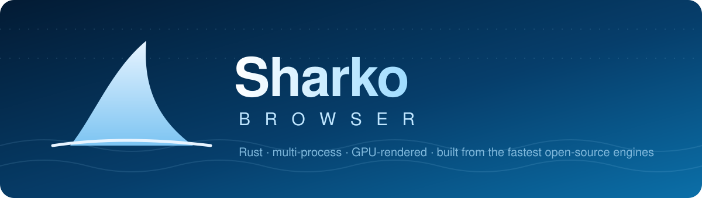
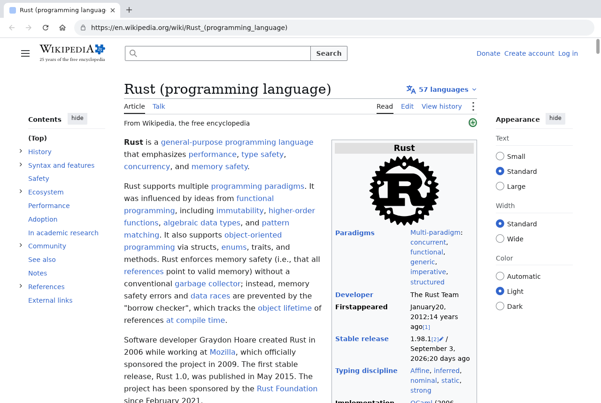
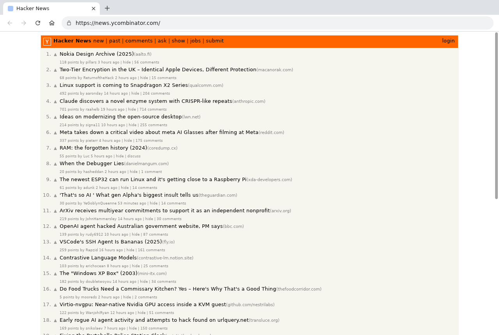
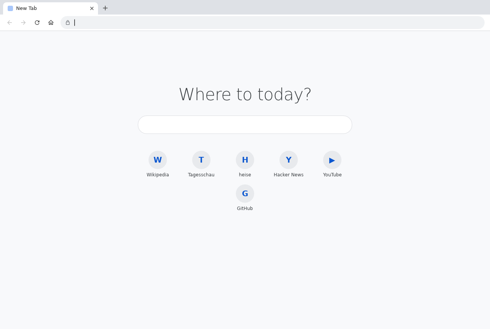
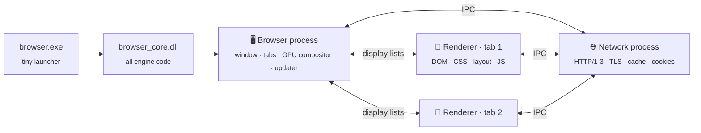

<p align="center">
  
</p>

<p align="center">
  <a href="../../releases/latest"></a>
  <a href="../../actions/workflows/ci.yml"></a>
  
  
  
</p>

<h3 align="center">I didn't like the other browsers.<br>So I made my own. 🦈</h3>

---

Every browser today is either Chromium in a trench coat or a giant legacy codebase.
I wanted something different: **take the fastest open-source component for every single
layer of a browser — and wire them together into one lean, modern, multi-process engine.**

No fork. No Electron. No WebView wrapper. Just Rust, a GPU, and the best parts of
Servo, Firefox, Chrome and the Linebender project, snapped together like Lego.

That's **Sharko**.

> **Status:** early prototype (0.x) — real websites like Wikipedia, Hacker News, GitHub,
> DuckDuckGo or news sites render well; complex web apps partially. Not a daily driver
> *yet*. [Deutsch](README.de.md)

## ✨ Screenshots

<p align="center">
  
  
</p>
<p align="center">
  
</p>

## ⚡ Why it's fast

| | |
|---|---|
| 🚀 **Instant window** | The window appears already painted. GPU, network and tab processes start in the background — the UI thread never waits. |
| 🎨 **GPU rendering** | Pages and UI are drawn by [Vello](https://github.com/linebender/vello), a compute-shader 2D renderer, on Vulkan / DX12 / Metal — with a multithreaded CPU fallback. |
| 🧵 **Parallel CSS** | Styles are computed by **Stylo**, Firefox's parallel style engine, across all your cores. |
| 🧱 **Process isolation** | Every tab runs in its own renderer process, Chrome-style. One tab crashes → only that tab shows a sad shark. |
| 🌐 **Modern networking** | HTTP/1.1, HTTP/2 and **HTTP/3 (QUIC)**, rustls with post-quantum key exchange, RFC 9111 cache. |
| 📜 **V8 JavaScript** | The same JS engine as Chrome, with startup snapshots — and no JS runtime at all for pages that don't need one. |
| 🔄 **Signed auto-updates** | ed25519-signed releases via GitHub, installed in the background, active on next start. |

## 🧪 Tested side by side with Chromium

Every change is checked by loading the same real sites in Sharko and in Chromium 141
(headless, 1280×800, cold cache) and comparing screenshots, page height, element count
and timings. Current state (median of 3 runs):

| Site | Sharko first frame | Sharko `load` | Chromium first paint | Chromium `load` | Page height Sharko / Chromium |
|---|---:|---:|---:|---:|---:|
| Wikipedia (article) | 534 ms | 1131 ms | 644 ms | 1402 ms | 35825 / 34007 px |
| Hacker News | 537 ms | 681 ms | 452 ms | 612 ms | 1199 / 1179 px |
| MDN | 321 ms | 771 ms | 856 ms | 1734 ms | 5311 / 5356 px |
| BBC News | 624 ms | 2192 ms | 388 ms | 5006 ms | 6085 / 6198 px |
| tagesschau.de | 1130 ms | 2097 ms | 1088 ms | 3520 ms | 19565 / 20998 px |
| The Guardian | 687 ms | 2710 ms | 708 ms | 13280 ms | 22907 / 23177 px |
| docs.rs | 451 ms | 702 ms | 468 ms | 952 ms | 973 / 974 px |
| python.org | 739 ms | 976 ms | 724 ms | 1093 ms | 2583 / 2474 px |
| lobste.rs | 561 ms | 809 ms | 988 ms | 1066 ms | 1734 / 1778 px |
| crates.io | 565 ms | 759 ms | 1528 ms | 411 ms | 2693 / 2693 px |
| Acid3 | 276 ms | 523 ms | 372 ms | 524 ms | — |

Sharko's numbers include starting its processes (Chromium was already running), and
news sites finish sooner partly because Sharko does not run every ad script to the end.
DOM micro-benchmark (create/query/traverse/layout, lower is better): Sharko 1250 ms,
Chromium 410 ms — the remaining gap is mostly `querySelectorAll` and DOM calls crossing
from JavaScript into Rust.

## 🧩 Built from the best

| Layer | Component | Origin |
|---|---|---|
| HTML parsing | [html5ever](https://github.com/servo/html5ever) | Servo |
| CSS / style | [Stylo](https://github.com/servo/stylo) | Firefox |
| Layout | [Taffy](https://github.com/DioxusLabs/taffy) + [Parley](https://github.com/linebender/parley) via [Blitz](https://github.com/DioxusLabs/blitz) | Dioxus / Linebender |
| Fonts / shaping | [Skrifa](https://github.com/googlefonts/fontations) + [HarfRust](https://github.com/harfbuzz/harfrust) | Google Fonts / HarfBuzz |
| Rendering | [Vello](https://github.com/linebender/vello) on [wgpu](https://wgpu.rs) | Linebender / gfx-rs |
| JavaScript | [V8](https://v8.dev) via [rusty_v8](https://github.com/denoland/rusty_v8) | Chrome / Deno |
| Networking | [hyper](https://hyper.rs) / [reqwest](https://github.com/seanmonstar/reqwest), HTTP/3 | Rust ecosystem |
| TLS | [rustls](https://github.com/rustls/rustls) + aws-lc-rs | Rust ecosystem |
| Windowing | [winit](https://github.com/rust-windowing/winit) | Rust ecosystem |

## 🗺️ Roadmap — this is just the beginning

Sharko is my browser, built the way *I* want a browser to work. The engine is the
foundation; now come the features I've always missed elsewhere:

- [ ] 🧑‍🤝‍🧑 **Sessions per tab** — every tab can have its own cookie jar and login. Use several
      accounts on the *same* site side by side (e.g. multiple Microsoft 365 tenants) —
      no more incognito juggling or separate browser profiles.
- [ ] 🎛️ **Hardware acceleration per tab** — switch GPU acceleration on or off for a single
      tab instead of the whole browser.
- [ ] 🛡️ **Built-in ad blocker** support.
- [ ] Bookmarks, downloads, password manager, extensions … and whatever else I like. 😄

## 🏗️ Architecture



Renderers paint pages into serializable **display lists**; the browser process rasterizes
them with Vello on the GPU together with the browser UI (itself HTML/CSS, rendered by the
same engine). Deep dive: [docs/ARCHITECTURE.md](docs/ARCHITECTURE.md).

## 📦 Install (Windows)

1. Download `browser-<version>-windows-x64.zip` from the [latest release](../../releases/latest).
2. Unzip anywhere and run `browser.exe` — or `browser.exe --install` for a per-user install
   with Start menu shortcut and automatic updates.

Portable mode: an empty file named `portable` next to `browser.exe` keeps the profile
(cookies, cache, logs) in a `profile` folder beside it.

## 🛠️ Build from source

Requirements: Rust (stable), Python 3 (Stylo's build script), and on Windows the Visual
Studio C++ Build Tools. On Linux also `clang lld libfontconfig1-dev`.

```sh
cargo build                      # debug: target/debug/browser + browser_core library
cargo run -p browser-launcher    # start the browser
cargo run -p browser-launcher -- --headless --screenshot=out.png https://example.com
```

`cargo xtask icu` copies V8's ICU data to `resources/` (needed for `Intl` in release
builds). Release package: `cargo build --release -p browser-core -p browser-launcher` then
`cargo xtask package --target <triple>`. Releases are built and signed by GitHub Actions
([docs/RELEASING.md](docs/RELEASING.md)).

## 🤖 Headless mode

```sh
browser --headless --screenshot=page.png https://en.wikipedia.org
browser --headless --full-page --screenshot=full.png https://news.ycombinator.com
browser --headless --eval="document.title" --console https://example.com
browser --headless --dump-dom https://example.com
browser --headless --click=640,400 --click-wait=2000 --screenshot=after.png https://example.com
```

`SHARKO_DEBUG_FRAMES=1` logs iframe runtimes and their `postMessage`s; with it,
`--eval="frames:JS"` evaluates in every iframe that runs script.

`BLITZ_VERIFY_INCREMENTAL=1` re-checks every incremental layout pass against a full one
and reports differences (for layout development).

## ⌨️ Keyboard shortcuts

`Ctrl+T` new tab · `Ctrl+W` close · `Ctrl+L` address bar · `Ctrl+Tab` next tab ·
`Alt+←/→` back/forward · `F5` reload · `Ctrl+ +/−/0` zoom · `F11` fullscreen

## 🚧 Known limitations

- Canvas 2D has no shadows or filters, and there is no video/audio or WebGL yet; Web
  Workers run on the page's thread
  (no parallelism yet, no module workers or SharedWorker)
- iframes (also nested ones) run JavaScript in their own runtime and talk to each other
  with `postMessage` (enough for consent dialogs); a page can't reach into same-origin
  iframes' documents yet; Shadow DOM is emulated (styles are scoped,
  declarative shadow roots work, but the shadow tree is part of the normal DOM);
  `position: sticky` only vertically
- Web Crypto covers SHA, HMAC, AES (GCM/CBC/CTR/KW), PBKDF2 and HKDF; no ECDSA, ECDH,
  RSA or Ed25519 yet
- Web Animations (`Element.animate`) interpolate numbers, lengths, colors and transform
  lists; no `composite` modes, scroll timelines or pseudo-element targets yet
- No downloads, bookmarks, extensions, password manager yet
- Bot-protection pages (Cloudflare challenges etc.) may block the browser

## 🤝 Contributing & license

See [CONTRIBUTING.md](CONTRIBUTING.md) and [SECURITY.md](SECURITY.md).

**Source-available, not open source.** You're welcome to read the code, build it, use it
privately and — most importantly — **help develop it** via issues and pull requests. Forking
is fine for preparing pull requests, but publishing your own version or using it
commercially is not allowed. Details: [LICENSE.md](LICENSE.md) (PolyForm Strict 1.0.0 plus a
contribution permission).

Third-party components keep their own licenses (Stylo and a few others are MPL-2.0, V8 is
BSD-3-Clause) — see [THIRD_PARTY_NOTICES.md](THIRD_PARTY_NOTICES.md).
